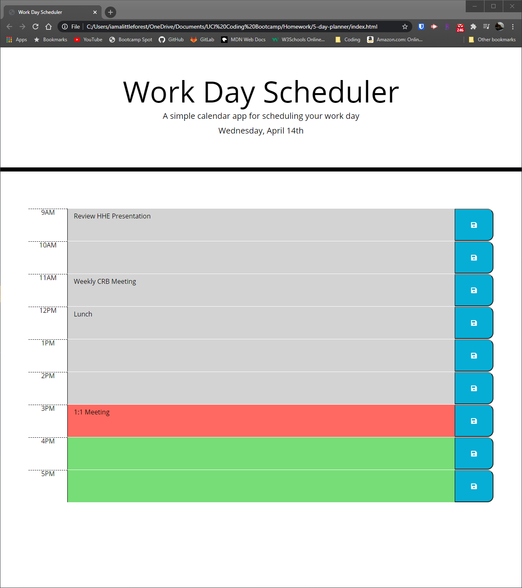

# Day Planner

## Link
https://iamalittleforest.github.io/5-day-planner/

## Languages & Technologies 
* HTML
* CSS
* Javascript

## Description
This calendar application allows a user to save events for each hour of the day using dynamically updated HTML and CSS powered by jQuery.

## Screenshot

## License
MIT License

## Contact Information
Wendy Kobayashi (<wykobayashi@gmail.com>)